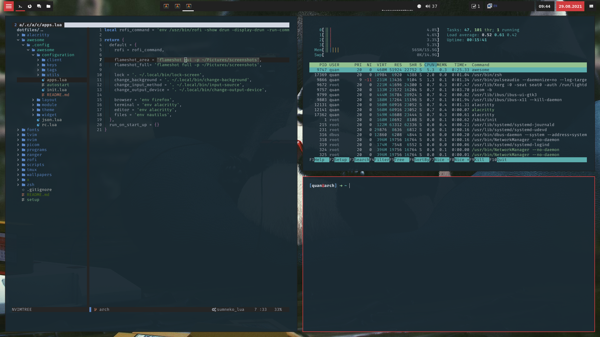

# Dotfiles



## Installing

You will need `git` and GNU `stow`

Clone into your `$HOME` directory or `~`

```bash
git clone https://gitlab.com/ldquan/dotfiles.git ~
```

Run `stow` to symlink everything or just select what you want

```bash
stow */ # Everything (the '/' ignores the README,setup file)
```

```bash
stow zsh # Just my zsh config
```

Setup and install packages

```bash
./setup.sh
```

## Programs

An updated list of all the programs I use can be found in the `programs` directory

## Environment

/etc/environment

```bash
  GTK_IM_MODULE=ibus
  QT_IM_MODULE=ibus
  XMODIFIERS=@im=ibus
```

## Reference

- Awesome WM: Mostly from [Redhound](https://github.com/Purhan/dotfiles/) with some personal modifications
- Neovim: Some ideas from [Lunarvim](https://github.com/LunarVim/LunarVim)
